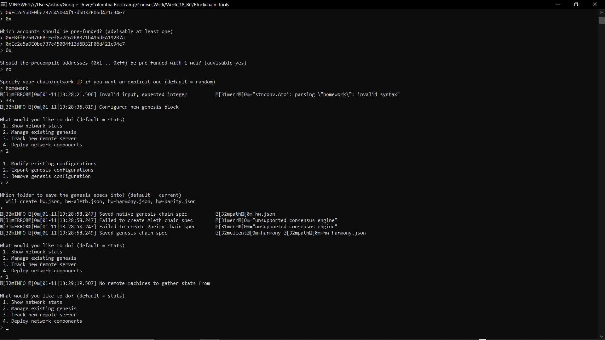
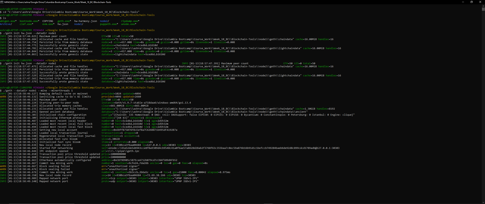
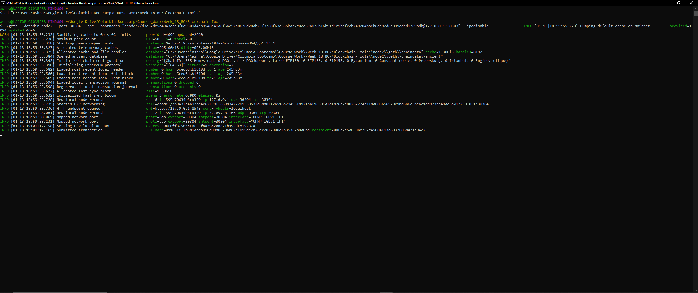
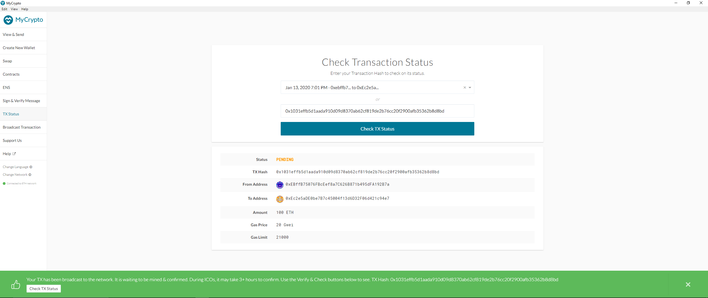

# HW_18_Proof-of-Authority-Development-Chain


## Instructions

1) Unlock the nodes, and make the network available to our applications (MyCrypto, Web3). In GitBash run the first node and enable the mining/sealing:

  ```bash
  geth --datadir node1 --unlock "c879d905c587ecea712b079cd7cc8af589d6fb52" --mine --rpc --allow-insecure-unlock
  ```


2. In a separate GitBash instance run the second node and enable the mining/sealing. To do this you need to copy the enode address from the first node. For example: `enode://b044f481e52f03950ed88ad18f550ace268ad4e4e1647f80c5808d6ea2c4e7f550d8ed25a14608afa6e5828f1b69fdfcf5d7775394f7c38d8592f600e4a37e90@127.0.0.1:30303`.  The GitBash command is as follows:

  ```bash
  geth --datadir node2 --unlock "80a2b0d33396e2c84fbe2b488085dbad21153622" --mine --port 30304 --bootnodes enode://NODE_ONE_ADDRESS@127.0.0.1:30303
  ```

3.  ### Transacting on the chain

* Open up MyCrypto and "Add Custom Node"

* The chain ID is 335.

* The URL is: `http://127.0.0.1:8545`.

* Save & Use Custom Node

* Click on "View & Send".

* Click on the "Private Key"

* Ask me for the PK. 

* Click the "Unlock" button to continue.

* Send a transaction to the other node at address 80a2b0d33396e2c84fbe2b488085dbad21153622

* Populate an amount of ETH. 

* Click "Send Transaction" and the "Send" button.

* Click 'Check TX Status'.


## GETH Command Line Options: 
* "--rpc":  Enable the HTTP-RPC server
* "--miner.threads value": Number of CPU threads to use for mining (default: 0)
*  "--mine": Enable mining
* "--allow-insecure-unlock": Allow insecure account unlocking when account-related RPCs are exposed by http
*  "--ipcdisable": Disable the IPC-RPC server

## Network Configuration: 

* "chainId": 335,
* "homesteadBlock": 0,
* "eip150Block": 0,
*  "eip150Hash": "0x0000000000000000000000000000000000000000000000000000000000000000",
*  "eip155Block": 0,
*  "eip158Block": 0,
*  "byzantiumBlock": 0,
*  "constantinopleBlock": 0,
*  "petersburgBlock": 0,
*  "istanbulBlock": 0,
*  "clique": {
*    "period": 2,
*    "epoch": 30000
* "Node1 Password": Node1
* "Node2 Password": Node2
* "Genesis Block Name"" HW
* "Server Address": http://127.0.0.1:8545

Screnshots
### Genesis Block Config
<p align="center">

</p>

### Node 1
<p align="center">

</p>

### Node 2
<p align="center">

</p>

### Transaction Record
<p align="center">

</p>